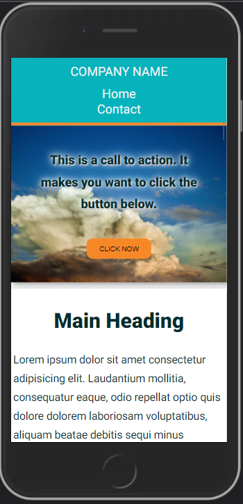
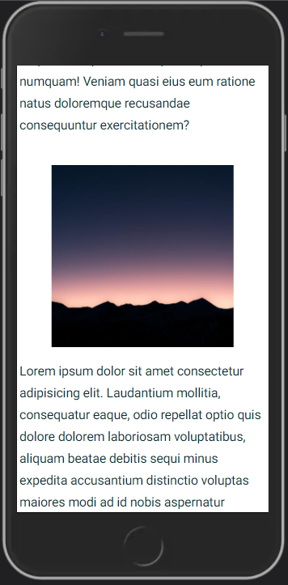
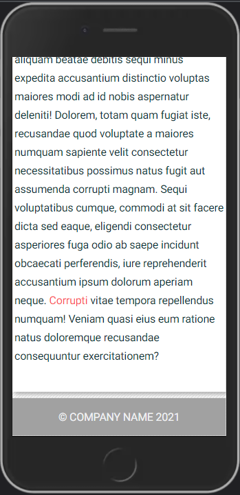

# Assignment 9: Create a Mobile-Responsive Website

(**NOTE:** View a rendered version of this file in VS Code with `ctrl-shift-v` or `cmd-shift-v`)

&nbsp;

&nbsp;
## Background

[Since 2017, over half of all website traffic originates from mobile devices](https://www.oberlo.com/statistics/mobile-internet-traffic). This assignment is designed to familiarize you with using CSS media queries to make websites that are responsive to mobile device screens. 

&nbsp;
## Setup

Create a git repository titled `m9-hw9-lastname-firstname` and clone the repo to your computer. Copy the **contents** of the `unsolved` folder into your repository. Ensure the `index.html` file is in the **root** of your repository so that it deploys to GitHub pages properly.

&nbsp;
## Instructions

Use the provided code in the `unsolved` folder to implement CSS media queries that allow the site to be responsive on smaller devices. Your submission should be as close to the provided mocks as possible. To receive full-credit you must:

1. Fix the header links to match the mockups.
1. Fix the `article` element's padding to allow text to be readable on smaller screens.
1. Fix the hero image's text so that it is not overly large on smaller devices.
1. Center the image embedded in the article's text.
1. Decrease the bottom margin on the different sections of the page.

Here are some hints to help:

* The site is already responsive on tablet-sized screens. **You can achieve the desired results with a single media query with a breakpoint of 500 pixels**.
* You do not need to change any of the existing CSS or HTML. You can fix all of the site's issues on mobile screens just by adding a media query to the end of the stylesheet.
* Use [Chrome dev tool's Device Mode](https://developer.chrome.com/docs/devtools/device-mode/) to view the site on cell phone-sized screens.
* You may have to undo some CSS applied to the elements in the stylesheet. You can usually achieve this by setting the property to the new desired value, or remove the style entirely by setting it to `none` or `0` depending on the type of property.

&nbsp;
## Deployment

Your code must be deployed to GitHub Pages. To deploy a repository to GitHub pages you must:

1. Ensure your repository has an `index.html` file in the root directory.
1. Navigate to the `settings` section of the repository.
1. Click on `pages` in the left navigation menu.
1. Under `source` click the dropdown and select your `master` or `main` branch.
1. Click `save`.

Your site should be deployed to `<your github username>.github.io/<your repository name>` in 5-10 minutes.

&nbsp;
## Submission

Please submit both a link to your repository and a link to the live site. Also please include any comments on stumbling blocks or difficulties encountered while completing the assignment.

&nbsp;
## Resources

* [CSS media queries on W3 Schools](https://www.w3schools.com/css/css3_mediaqueries.asp)
* [A Complete Guide to CSS Media Queries on CSS-Tricks](https://css-tricks.com/a-complete-guide-to-css-media-queries/)# m9-hw9-macdonald-nicholas
